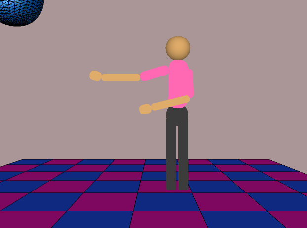

# Inverse-Kinematics

Single-arm IK and Multi-arm IK
* Created an animation with a skeleton that has 2 arms, 2 legs, a torso and a head. The arms have 3 joints each, the legs have one joint each and the upper body, hips and the head also have a single joint each. The legs and the upper body are connected to the hip which serves as the root of the skeleton. The arms are connected to the upper body. Both arms and legs can follow the movement of the mouse and touch an object that’s not out of reach.
* We can switch between controlling the arms and the legs as well as the right and left. Which means there are 4 total end effectors.
* The root (hips) stays stationary during the reach animation.

Joint Limits
* Added angle and rotational speed limits to all skeleton joints.
* Joint and speed limit list:
   * Shoulders
      * limit: 90, acceleration cap: 5  
   * Elbows:
      * limit: 180, acceleration cap: 6  
   * Wrist:
      * limit: 90, acceleration cap: 8
   * Legs:
      * limit: 45, acceleration cap: 5  
   * Hips:
      * limit: 1, acceleration cap: 2  
   * Upper body:
      * limit: 2, acceleration cap: 2

Moving IK
* The skeleton is able to move its root in the direction of the mouse in a natural looking fashion.

User Interaction
* Camera Controls:
   * w,a,s,d keys: moves the camera forward, backward, left and right
   * UP, DOWN, LEFT, RIGHT keys: rotates the camera in the respective direction
   * Shift: boosts the movement speed
   * R key: resets the camera to its default position and orientation
* Skeleton Controls
   * Press “1”: IK solver for the right arm
   * Press “2”: IK solver for the left arm
   * Press “3”: IK solver for the right leg
   * Press “4”: IK solver for the left leg
   * Press “5”: Moves the root of the skeleton towards the direction of the mouse
   * Press space: IK solver for both arms (party mode)

3D Rendering & Camera
* Implemented 3D rendering and camera functionality. The camera controls are mentioned in the User Interaction section. The scene is well lit allowing for clear visibility of surfaces and objects. (There is also a disco ball)

Image

